# lagu-platform — service architecture

Traced directly from source (Kafka topic constants, `@KafkaListener`/`KafkaTemplate` usage,
outbound REST clients, Flyway schemas) as of 2026-07-25 — not from the original design docs in
`todo/`, which several services have since diverged from. Re-derive this from source rather than
trusting it blindly once the codebase has moved on.

## Topology

```mermaid
flowchart TB
  subgraph EDGE["Edge"]
    direction LR
    GW["gateway-service\n(Spring Cloud Gateway)"]
    EUREKA["registry-service\n(Eureka)"]
  end

  subgraph CORE["Core platform services"]
    direction LR
    SCHEMA["schema-registry"]
    RECORD["record-service"]
    WORKFLOW["workflow-service"]
    AUTOMATION["automation-service"]
  end

  subgraph DOMAIN["Business domain services"]
    direction LR
    VENDOR["vendor-service"]
    LISTING["listing-service"]
    DOCUMENT["document-service"]
    NOTIFICATION["notification-service"]
    SEARCH["search-service"]
    BOOKING["booking-service\n(scaffold only)"]
  end

  KAFKA{{"Kafka event bus"}}

  subgraph DATA["Data stores"]
    direction LR
    PG[("Postgres\nplatformdb")]
    REDIS[("Redis")]
    OS[("OpenSearch")]
  end

  subgraph EXT["External systems (separate repos)"]
    direction LR
    IAM["user-service\n(IAM)"]
    IMAGE["image-service"]
  end

  GW -.->|routes authenticated requests| CORE
  GW -.->|routes authenticated requests| DOMAIN
  GW -.->|discovers via| EUREKA
  CORE -.->|registers| EUREKA
  DOMAIN -.->|registers| EUREKA

  SCHEMA ==>|schema.events| KAFKA
  RECORD ==>|"record.events, verification.events"| KAFKA
  WORKFLOW ==>|workflow.events| KAFKA
  AUTOMATION ==>|automation.events| KAFKA
  DOCUMENT ==>|document.events| KAFKA
  LISTING ==>|listing.events| KAFKA

  KAFKA ==>|"schema.events, workflow.events"| RECORD
  KAFKA ==>|record.events| WORKFLOW
  KAFKA ==>|"record.events, workflow.events"| AUTOMATION
  KAFKA ==>|automation.events| NOTIFICATION
  KAFKA ==>|workflow.events| LISTING
  KAFKA ==>|"listing.events, record.events, schema.events"| SEARCH

  VENDOR -->|create/fetch record, doc status| RECORD
  VENDOR -->|associate org with user| IAM
  RECORD -->|schema + relationship lookups| SCHEMA
  RECORD -->|file upload| IMAGE
  DOCUMENT -->|document-type catalog| SCHEMA
  DOCUMENT -->|file storage| IMAGE
  LISTING -->|fetch record snapshot| RECORD
  SEARCH -->|list records| RECORD
  SEARCH -->|index mapping| SCHEMA

  SCHEMA -.-> PG
  RECORD -.-> PG
  WORKFLOW -.-> PG
  AUTOMATION -.-> PG
  VENDOR -.-> PG
  LISTING -.-> PG
  DOCUMENT -.-> PG
  NOTIFICATION -.-> PG
  RECORD -.-> REDIS
  SCHEMA -.-> REDIS
  SEARCH -.-> REDIS
  SEARCH -.-> OS

  classDef core fill:#e8eef8,stroke:#2b5c9e,color:#1b2029,font-weight:600;
  classDef domain fill:#e7f3ec,stroke:#2f7d54,color:#1b2029,font-weight:600;
  classDef infra fill:#edeef1,stroke:#5b6472,color:#1b2029;
  classDef ext fill:#f1eaf9,stroke:#7a4fb0,stroke-dasharray: 4 3,color:#1b2029;
  classDef scaffold fill:#f2f2f3,stroke:#8a8f98,stroke-dasharray: 4 3,color:#5b6472,font-style:italic;
  classDef bus fill:#fff3d6,stroke:#b8860b,color:#4a3800,font-weight:600;

  class SCHEMA,RECORD,WORKFLOW,AUTOMATION core;
  class VENDOR,LISTING,DOCUMENT,NOTIFICATION,SEARCH domain;
  class BOOKING scaffold;
  class PG,REDIS,OS infra;
  class GW,EUREKA,IAM,IMAGE ext;
  class KAFKA bus;
```

**Legend:** solid arrow = REST call · thick arrow = Kafka publish/consume (labeled with topic) ·
dotted arrow = reads/writes a data store or service registration. Dashed-border nodes are outside
this monorepo or unimplemented.

## Caveats

- `docker-compose.yml` was mid-edit on disk when this was written (uncommitted changes stripped it
  to 3 services) — this diagram reflects the full committed service set at `HEAD`, not whatever
  the working tree looked like at that moment. Re-check before relying on it.
- `booking-service` has no source files, no Flyway migrations, and isn't wired into
  `settings.gradle.kts` — included here only because it's a named module under `apps/`. Its README
  calls it scaffold-only.
- `platform.booking.events` is defined in `libs/events/PlatformTopics` but has zero producers or
  consumers anywhere in the codebase today.
- `vendor-service` has Kafka producer/consumer config wired (dependency + `application.yml`) but
  publishes and consumes nothing — reserved for future use per its own README.
- `gateway-service` and `registry-service` (Eureka) live in separate repos, not this monorepo.

## Service reference

Outbox = uses the shared transactional-outbox library (`libs/common`) instead of a bare
`KafkaTemplate.send`.

| Service | Purpose | DB schema | Produces | Consumes | Outbox |
|---|---|---|---|---|---|
| **schema-registry** (core) | Central metadata service — field/listing-type/tier/document-requirement definitions stored as data. Absorbed the old `metadata-service`. Not a Eureka server. | `schema_registry` | `schema.events` | — | Yes |
| **record-service** (core) | Generic metadata-driven record CRUD, plus verification/status lifecycle. | `records` | `record.events`, `verification.events` | `schema.events`, `workflow.events` | Yes |
| **workflow-service** (core) | State-machine-driven status transitions and approvals for records. | `workflow` | `workflow.events` | `record.events` | Yes |
| **automation-service** (core) | Rules engine — runs trigger/action automations off record and workflow events. | `automation` | `automation.events` | `record.events`, `workflow.events` | No — direct `KafkaTemplate.send` |
| **vendor-service** (domain) | Vendor org onboarding, review-status lifecycle (DRAFT→SUBMITTED→…→ACTIVE), KYC checklist orchestration. Calls record-service and external IAM (user-service). | `vendor` | none implemented | none implemented | n/a |
| **listing-service** (domain) | Builds and serves denormalized listing snapshots for consumer-facing display. | `listing` | `listing.events` | `workflow.events` | Yes |
| **document-service** (domain) | Vendor document upload and verification review workflow. | `documents` | `document.events` | none | No — direct `KafkaTemplate.send` |
| **notification-service** (domain) | Delivers email notifications triggered by automation events. | `notification` | none | `automation.events` | No |
| **search-service** (domain) | Indexes and serves search via OpenSearch; keeps the index in sync with records/listings/schema. | none — OpenSearch + Redis backed, JPA/Flyway excluded | none | `listing.events`, `record.events`, `schema.events` | n/a |
| **booking-service** (scaffold) | Scaffold only — README says "not implemented." No source, no migrations, not in the Gradle build. | planned: `booking` | none | none | n/a |

Shared libraries used by every service above: `libs/common` (outbox, `ApiResponse` envelope,
exception handling), `libs/events` (topic constants + event DTOs), `libs/security` (gateway
header-trust filter — trusts `X-User-Id` / `X-Org-Id` / `X-User-Roles` only alongside a
shared-secret header; internal service-to-service calls carry `X-Internal-Service` instead).
